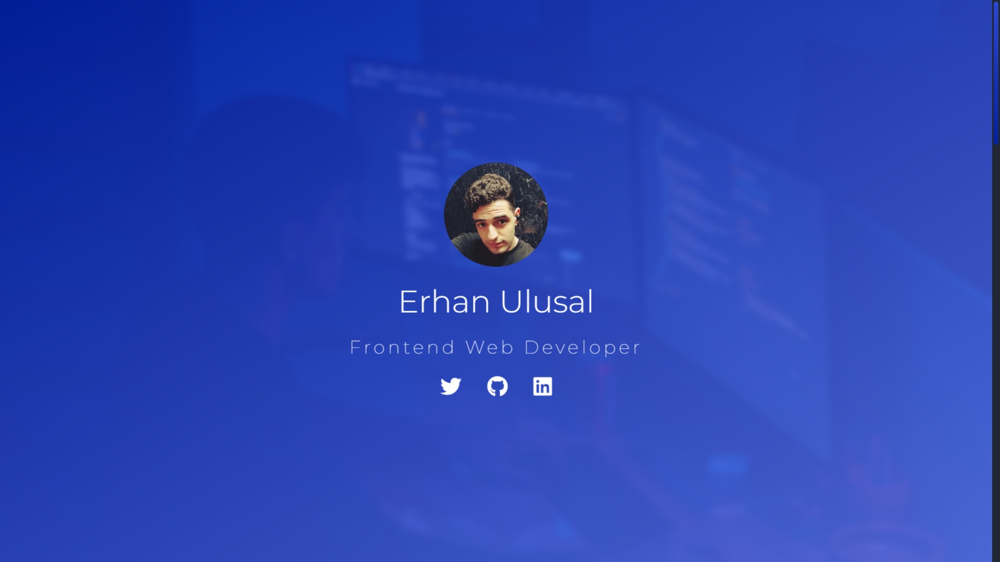
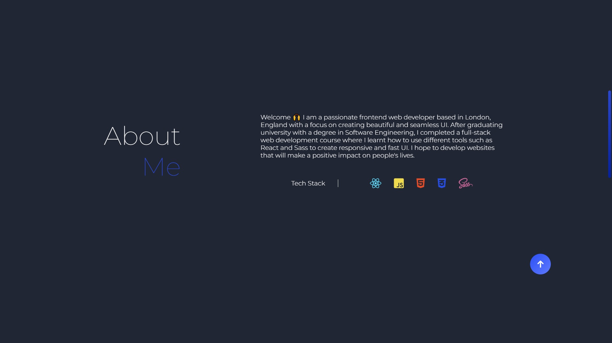
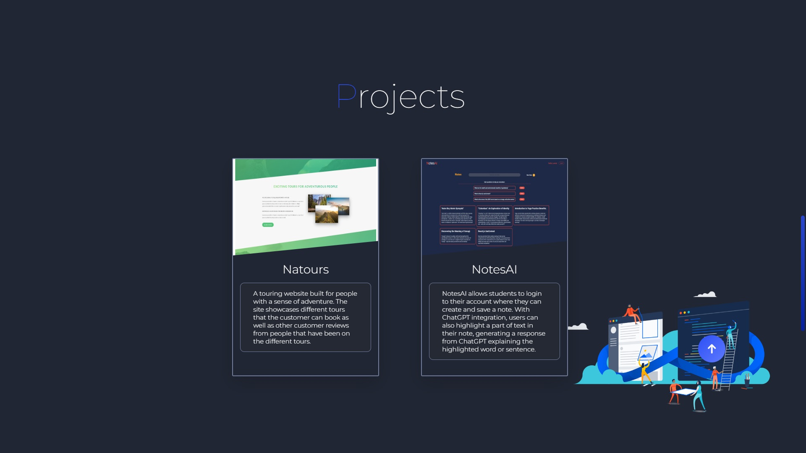

<!-- PROJECT LOGO -->

  

<!-- PROJECT OVERVIEW -->
 
  <h3 align="center">Erhan Ulusal | Portfolio Website</h3>

  

    A personal portfolio website to showcase my projects and skills.
     
  

<!-- TABLE OF CONTENTS -->

  
Table of Contents

  <ol>
    <li><a href="#about-the-project">About The Project</a></li>
    <li><a href="#built-with">Built With</a></li>
    <li><a href="#screenshots">Screenshots</a></li>
  </ol>

<!-- ABOUT THE PROJECT -->
## About The Project
A personal portfolio website that showcases the different major projects I have undertaken so far throughout my journey as a web developer. The website provides a short section about me as well as a projects section with links to both the github repositories and the live website (if deployed). A short section at the bottom outlines some ways to get in contact with me.

<b>Link to live demo: (project still under development)</b>

(<a href="#readme-top">Back to top</a>)

<!-- BUILT WITH -->
## Built With
* [![React][React]][React-url]
<!-- * [![React-router][React-router]][React-router-url] -->
<!-- * [![JavaScript][JavaScript]][JavaScript-url] -->
<!-- * ![CSS][CSS] -->
* [![Sass][Sass]][Sass-url]
* ![HTML5][HTML5]
* [![Vite][Vite]][Vite-url]
<!-- * [![Firebase][Firebase]][Firebase-url] -->

(<a href="#readme-top">back to top</a>)

<!-- Screenshots -->
## Screenshots

(<a href="#readme-top">back to top</a>)

<!-- MARKDOWN LINKS -->
[React]: https://img.shields.io/badge/react-%2320232a.svg?style=for-the-badge&logo=react&logoColor=%2361DAFB
[React-url]: https://react.dev

[React-router]: https://img.shields.io/badge/React_Router-CA4245?style=for-the-badge&logo=react-router&logoColor=white
[React-router-url]: https://reactrouter.com/en/main

[JavaScript]: https://img.shields.io/badge/JavaScript-323330?style=for-the-badge&logo=javascript&logoColor=F7DF1E
[JavaScript-url]: https://www.javascript.com

[CSS]: https://img.shields.io/badge/css3-%231572B6.svg?style=for-the-badge&logo=css3&logoColor=white

[Sass]: https://img.shields.io/badge/Sass-CC6699?style=for-the-badge&logo=sass&logoColor=white
[Sass-url]: https://sass-lang.com

[HTML5]: https://img.shields.io/badge/HTML-239120?style=for-the-badge&logo=html5&logoColor=white

[Vite]: https://img.shields.io/badge/vite-%23646CFF.svg?style=for-the-badge&logo=vite&logoColor=white
[Vite-url]: https://vitejs.dev

[Firebase]: https://img.shields.io/badge/Firebase-039BE5?style=for-the-badge&logo=Firebase&logoColor=white
[Firebase-url]: https://firebase.google.com
